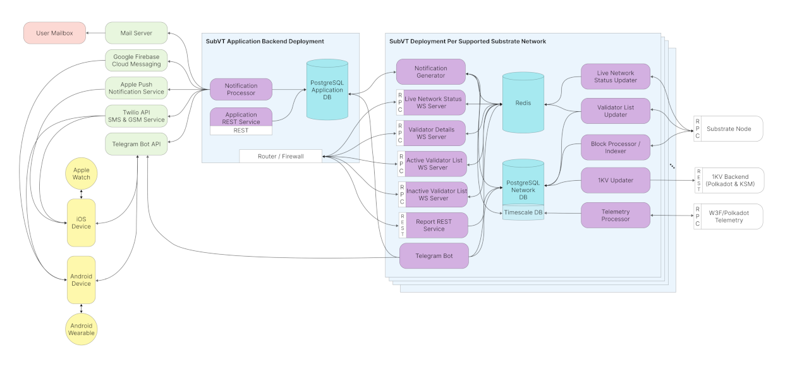

# SubVT System Architecture

  
   
  <i>
    <b>Figure 1</b> SubVT system (click for the large version)
  </i>

## Components

### 1. Block Processor/Indexer ([code](https://github.com/helikon-labs/subvt-backend/tree/main/subvt-block-processor))
- Subscribes to the finalized blocks on the Substrate node using the SubVT Substrate
  [client](https://github.com/helikon-labs/subvt-backend/tree/main/subvt-substrate-client). 
- Fetches and stores the events and extrinsics (only the ones that are of interest to SubVT, such as validate extrinsics, 
  offline and rewarded events etc.) of each block in the PostgreSQL network database.
- Stores era, era validator, era staker, total era points, era point per validator and more data as it moves block by block.
- `NOTIFY`s the PostgreSQL network database. Notification generator subscribes to this notification, and scans the persisted
  block data for possible notification cases.

### 2. Network Status Updater ([code](https://github.com/helikon-labs/subvt-backend/tree/main/subvt-network-status-updater))
- With every new finalized block, fetches the network status data from the Subtrate node and stores it in the Redis
  in-memory database, and makes a `PUBLISH` call so that Redis can notify the network status server and notification
  server to carry out their related operations on the fresh network status data.
- Network status data contains finalized and best block numbers and hashes, active era and current epoch, active and
  inactive validator counts, total stake, minimum/maximum/average/median validator stakes, and more information.

### 3. Network Status WS Server ([code](https://github.com/helikon-labs/subvt-backend/tree/main/subvt-network-status-server))
- Specified [here](https://github.com/helikon-labs/subvt-backend/blob/main/subvt-live-network-status-server/README.md).
- Subscribes to the Redis notifications from the network status updater.
- Accepts incoming WebSocket pub/sub connections through the configured port.
- Provides two RPC methods: `subscribe_networkStatus` and `unsubscribe_networkStatus`.
- Sends the complete network status data to the client on initial subscription, and then only sends the updated parts of 
  the network status data after each new finalized block as long as the client remains connected.
- Designed to provide data to the SubVT network status screen.

### 4. Validator List Updater ([code](https://github.com/helikon-labs/subvt-backend/tree/main/subvt-validator-list-updater))
- Every few blocks, fetches the complete inactive and active validator data from the Substrate node.
- Also fetches the indexed validator data from the PostgreSQL network database such as account discovered/killed at,
  slashes, era reward points if active, heartbeat events, 1KV if exists, etc.
- Prepares validator details and validator summary data, and stores all this data in Redis along with the hashes for 
  each record, so that any component observing the records can figure out whether the records have changed by comparing
  the hashes, without the need to fetch the complete data.
- `PUBLISH`es a Redis notification after the successful processing on a finalized block.

### 5. Validator List WS Server ([code](https://github.com/helikon-labs/subvt-backend/tree/main/subvt-validator-list-server))
- Specified [here](https://github.com/helikon-labs/subvt-backend/blob/main/subvt-validator-list-server/README.md).
- Subscribes to the Redis event published by the validator list updater.
- Accepts incoming WebSocket pub/sub connections through the configured port.
- Provides two RPC methods: `subscribe_validatorList` and `unsubscribe_validatorList`.
- Sends the complete validator list data to the client on initial subscription, and then only sends the updated parts of
  the validator list data after each update from the validator list updater as long as the client remains connected.
- Designed to provide data to the SubVT active and inactive validator list screens.

### 6. Validator Details WS Server ([code](https://github.com/helikon-labs/subvt-backend/tree/main/subvt-validator-details-server))
- Specified [here](https://github.com/helikon-labs/subvt-backend/blob/main/subvt-validator-details-server/README.md).
- Subscribes to the Redis event published by the validator list updater.
- Accepts incoming WebSocket pub/sub connections through the configured port.
- Provides two RPC methods: `subscribe_validatorDetails` and `unsubscribe_validatorDetails`, former with the validator
  account id in hex format as the first parameter.
- Send the complete validator details data to the client on initial subscription, and then only sends the updated parts
  of the validator details data after each update from the validator list updater as long as the client remains 
  connected.

### 7. 1KV Updater ([code](https://github.com/helikon-labs/subvt-backend/tree/main/subvt-onekv-updater))
- Fetches the complete candidate data from the 1KV backend (only Polkadot or Kusama).
- Stores the candidate data in the PostgreSQL network database.
- Data is then used to generate 1KV-related notifications, also served by the validator list and validator details 
  services.

### 8. Telemetry Processor ([code](https://github.com/helikon-labs/subvt-backend/tree/main/subvt-telemetry-processor))
- Subscribed to the Telemetry feed of the configured Telemetry server (possibly W3F or Polkadot Telemetry servers).
- Stores node data, and utilizes TimescaleDB extension for PostgreSQL to store node statistics (transaction count, peer
  count), hardware (upload/download bandwidth) time-series data.
- Provides data to the notification generator component, which does regular checks on the time-series data for possible
  notification cases.

### 9. Notification Generator ([code](https://github.com/helikon-labs/subvt-backend/tree/main/subvt-notification-generator))
- Processes the indexed block (PostgreSQL), validator list (Redis) and Telemetry time-series (TimescaleDB) data for 
  possible notifications.
- Requires notification rules to be defined by the system or users.
- Persists notifications into the PostgreSQL application database, soon to be processed by the notification sender.

### 10. Notification Sender ([code](https://github.com/helikon-labs/subvt-backend/tree/main/subvt-notification-sender))
- Processes the notifications persisted by the notification generator, and sends notifications to the appropriate
  channels (APNS, FCM, email, SMS, GSM, Telegram, etc.) as defined by the notification rules.
- Uses different templates for different channels to generate notification content.

### 11. Report REST Service ([code](https://github.com/helikon-labs/subvt-backend/tree/main/subvt-report-service))
- Specified [here](https://github.com/helikon-labs/subvt-backend/blob/main/subvt-report-service/open-api-spec/subvt_report_service.yml), 
  viewable [here](https://helikon-labs.stoplight.io/docs/subvt/YXBpOjM0MDAzMjEz-sub-vt-report-service).
- Public REST services that serves era and era-validator reports.
- Gets its data completely from the PostgreSQL network database.

### 12. Application REST Service ([code](https://github.com/helikon-labs/subvt-backend/tree/main/subvt-app-service))
- Specified [here](https://github.com/helikon-labs/subvt-backend/blob/main/subvt-app-service/open-api-spec/subvt_app_service.yml), 
  viewable [here](https://helikon-labs.stoplight.io/docs/subvt/YXBpOjM0Mjg0NzAw-sub-vt-application-service).
- SubVT application-related public and secure REST services such as:
    - `GET` network list.
    - `GET` notification types.
    - `GET` notification channels.
    - `POST` new user.
    - `POST` new notification channel for user (e.g. add a new email address or phone number for SMS).
    - `POST` new notification rule for user.
    - `DELETE` one of the user's notification rules.
    - `POST` new validator for the user (i.e. bookmark).
    - And many more.

## Feasibility and Implementation
Current model builds on top of the [initial proposal](https://docs.google.com/document/d/1mCD1lRoEwbV3Xp5N-HzEKA0KROCmNkMFInLGd4nAz-k/edit?usp=sharing),
and is perfectly feasible as shown by the current [implementation](https://github.com/helikon-labs/subvt-backend).