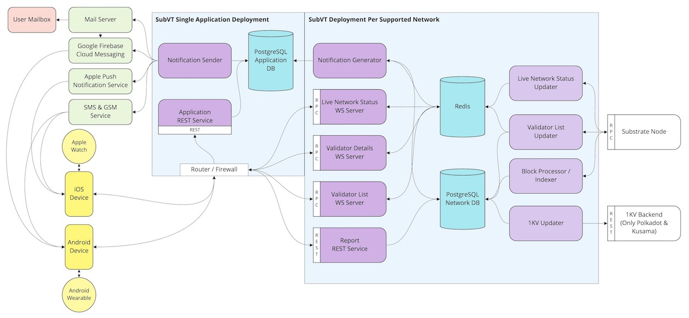

## SubVT System Architecture

 
<i><b>Figure 1</b> SubVT system</i>

SubVT backend consists of the following components:

1. Block Processor/Indexer
2. Live Network Status Updater
3. Live Network Status WS Server
4. Validator List Updater
5. Validator List WS Server
6. Validator Details WS Server
7. 1KV Updater
8. Notification Generator
9. Notification Sender
10. Report REST Service
11. Application REST Service